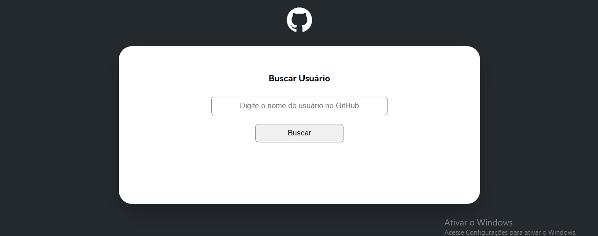
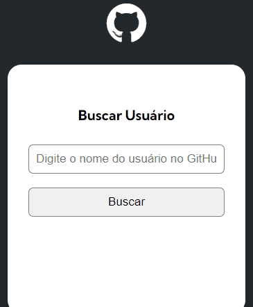

<h1 align="center">Projeto inicial: Fetch, Github e API </h1>

Projeto inicial: Fetch, Github e API consiste em um consumo da API do Github, pegando os dado do usuário, como por exemplo: foto do perfil, bio, nome do usuário, número de seguidores, ultimos eventos e repositórios 

  <a href="#-tecnologias">Tecnologias</a>&nbsp;&nbsp;&nbsp;|&nbsp;&nbsp;&nbsp;
  <a href="#-projeto">Projeto</a>&nbsp;&nbsp;&nbsp;&nbsp;&nbsp;&nbsp;
  

 
  <h2 align= 'center'>Desktop Version</h2>
  

  
  

  <h2 align= 'center'>Mobile Version</h2>
  

  
  

  
## 🚀 Tecnologias

Esse projeto foi desenvolvido com as seguintes tecnologias:

- HTML
- CSS
- Javascript
- API
- Git e Github

## 💻 Projeto

Esse é o Projeto inicial: Fetch, Github e API

- [Acesse o projeto finalizado, online](https://carlosherbertdev.github.io/portfolio/)